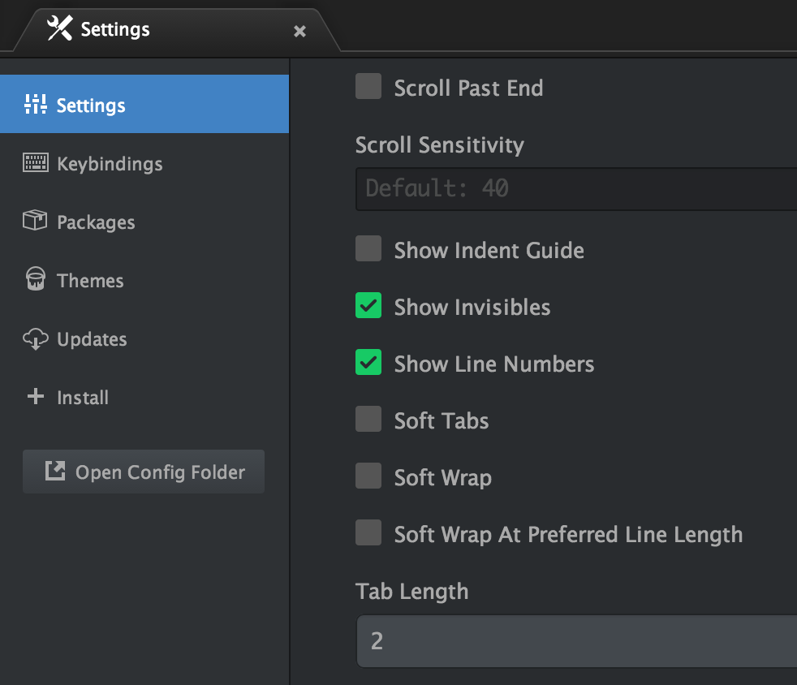

# Node.js Style Guide

This is a guide for writing consistent and aesthetically pleasing node.js code at Spark.
It is inspired by what is popular within the community, and flavored with some
personal opinions.

There is a `.eshintrc` which enforces these rules as closely as possible.

This is based on guide created by [Felix Geisendörfer](http://felixge.de/) and is
licensed under the [CC BY-SA 3.0](http://creativecommons.org/licenses/by-sa/3.0/)
license.


## Table of contents

* [Tab for indention](#tab-for-indention)
* [Newlines](#newlines)
* [No trailing whitespace](#no-trailing-whitespace)
* [Use Semicolons](#use-semicolons)
* [80 characters per line](#80-characters-per-line)
* [Use single quotes](#use-single-quotes)
* [Opening braces go on the same line](#opening-braces-go-on-the-same-line)
* [Method chaining](#method-chaining)
* [Declare one variable per var statement](#declare-one-variable-per-var-statement)
* [Use lowerCamelCase for variables, properties and function names](#use-lowercamelcase-for-variables-properties-and-function-names)
* [Use UpperCamelCase for class names](#use-uppercamelcase-for-class-names)
* [Use UPPERCASE for Constants](#use-uppercase-for-constants)
* [Use _underscore for private functions/vars](use-_underscore-for-private-functionsvars)
* [Naming files](#naming-files)
* [Modularize](#modularize)
* [Object / Array creation](#object--array-creation)
* [Use the === operator](#use-the--operator)
* [Use one-line ternary operator](#use-one-line-ternary-operator)
* [Do not extend built-in prototypes](#do-not-extend-built-in-prototypes)
* [Use descriptive conditions](#use-descriptive-conditions)
* [Keep operators on the beginning of the line](#keep-operators-on-the-beginning-of-the-line)
* [Write small functions](#write-small-functions)
* [Return early from functions](#return-early-from-functions)
* [Name your closures](#name-your-closures)
* [No nested closures](#no-nested-closures)
* [Use slashes for comments](#use-slashes-for-comments)
* [Don't execute code inline](#dont-execute-code-inline)
* [Object.freeze, Object.preventExtensions, Object.seal, with, eval](#objectfreeze-objectpreventextensions-objectseal-with-eval)
* [IIFE](#iife)
* [Use strict mode](#use-strict-mode)
* [Getters and setters](#getters-and-setters)

## Tab for indention

Use tab character for indenting your code and swear an oath to never mix tabs and
spaces - a special kind of hell is awaiting you otherwise.

### GitHub Atom setup

Atom detects automatically if file uses tabs or spaces. Still to prevent any issues, disable **Soft Tabs** in **Editor Settings**:



You can also enable **Show Invisibles** to see what whitespace is used (dots for spaces and arrows for tabs).

### IntelliJ IDEA family (WebStorm, PyCharm, RubyMine etc.)

*TBD*

### Vim

*TBD*

### Emacs

*TBD*

## Newlines

Use UNIX-style newlines (`\n`), and a newline character as the last character
of a file. Windows-style newlines (`\r\n`) are forbidden inside any repository.

## No trailing whitespace

Just like you brush your teeth after every meal, you clean up any trailing
whitespace in your JS files before committing. Otherwise the rotten smell of
careless neglect will eventually drive away contributors and/or co-workers.

## Use Semicolons

According to [scientific research][hnsemicolons], the usage of semicolons is
a core value of our community. Consider the points of [the opposition][], but
be a traditionalist when it comes to abusing error correction mechanisms for
cheap syntactic pleasures.

[the opposition]: http://blog.izs.me/post/2353458699/an-open-letter-to-javascript-leaders-regarding
[hnsemicolons]: http://news.ycombinator.com/item?id=1547647

## 80 characters per line

Limit your lines to 80 characters. Yes, screens have gotten much bigger over the
last few years, but your brain has not. Use the additional room for split screen,
your editor supports that, right? This will be marked as warning while linting.

## Use single quotes

Use single quotes, unless you are writing JSON.

*Right:*

```js
var foo = 'bar';
```

*Wrong:*

```js
var foo = "bar";
```

Only exception are strings containing single quotes:

*[Acceptable](http://media.tumblr.com/47b7271983a0a618935e04c5bd8d1c66/tumblr_inline_mvv37q8FMd1ro2x8m.jpg):*

```js
var foo = "bar is 'baz'";
```

## Opening braces go on the same line

Your opening braces go on the same line as the statement.

*Right:*

```js
if (true) {
  console.log('winning');
}
```

*Wrong:*

```js
if (true)
{
  console.log('losing');
}
```

Also, notice the use of whitespace before and after the condition statement.

## Method chaining

One method per line should be used if you want to chain methods.

You should also indent these methods so it's easier to tell they are part of the same chain.

*Right:*

```js
User
  .findOne({ name: 'foo' })
  .populate('bar')
  .exec(function(err, user) {
    return true;
  });
```

*Wrong:*

```js
User
.findOne({ name: 'foo' })
.populate('bar')
.exec(function(err, user) {
  return true;
});

User.findOne({ name: 'foo' })
  .populate('bar')
  .exec(function(err, user) {
    return true;
  });

User.findOne({ name: 'foo' }).populate('bar')
.exec(function(err, user) {
  return true;
});

User.findOne({ name: 'foo' }).populate('bar')
  .exec(function(err, user) {
    return true;
  });
```

## Declare one variable per var statement

Declare one variable per var statement, it makes it easier to re-order the
lines. However, ignore [Crockford][crockfordconvention] when it comes to
declaring variables deeper inside a function, just put the declarations wherever
they make sense.

*Right:*

```js
var keys   = ['foo', 'bar'];
var values = [23, 42];

var object = {};
while (keys.length) {
  var key = keys.pop();
  object[key] = values.pop();
}
```

*Wrong:*

```js
var keys = ['foo', 'bar'],
    values = [23, 42],
    object = {},
    key;

while (keys.length) {
  key = keys.pop();
  object[key] = values.pop();
}
```

[crockfordconvention]: http://javascript.crockford.com/code.html

## Use lowerCamelCase for variables, properties and function names

Variables, properties and function names should use `lowerCamelCase`.  They
should also be descriptive. Single character variables and uncommon
abbreviations should generally be avoided.

*Right:*

```js
var adminUser = db.query('SELECT * FROM users ...');
```

*Wrong:*

```js
var admin_user = db.query('SELECT * FROM users ...');
```

## Use UpperCamelCase for class names

Class names should be capitalized using `UpperCamelCase`.

*Right:*

```js
function BankAccount() {
}
```

*Wrong:*

```js
function bank_Account() {
}
```

## Use UPPERCASE for Constants

Constants should be declared as regular variables or static class properties,
using all uppercase letters.

Node.js / V8 actually supports mozilla's [const][const] extension, but
unfortunately that cannot be applied to class members, nor is it part of any
ECMA standard.

*Right:*

```js
var SECOND = 1 * 1000;

function File() {
}
File.FULL_PERMISSIONS = 0777;
```

*Wrong:*

```js
const SECOND = 1 * 1000;

function File() {
}
File.fullPermissions = 0777;
```

[const]: https://developer.mozilla.org/en/JavaScript/Reference/Statements/const

## Use _underscore for private functions/vars

When function/variable is supposed to be internal an can be changed/removed without notice, prefix it with `_`:

```js
var foo = {
  _internal: 1,
  external: 2
};
```

## Naming files

Filename of module exporting a class should match the class's name (i.e. `module.exports = UserCreator` should be in `UserCreator.js` file).

Test specs should be suffixed with `.spec.js` (i.e. `UserCreator.spec.js`).

Always group modules in directories based on their function (i.e. models, controllers and views in separate dirs).

## Modularize

Keep your files under 1000 lines. If it gets longer, try to refactor it into smaller modules.

## Object / Array creation

Use trailing commas and put *short* declarations on a single line. Only quote
keys when your interpreter complains:

*Right:*

```js
var a = ['hello', 'world'];
var b = {
  good: 'code',
  'is generally': 'pretty',
};
```

*Wrong:*

```js
var a = [
  'hello', 'world'
];
var b = {"good": 'code'
        , is generally: 'pretty'
        };
```

## Use the === operator

Programming is not about remembering [stupid rules][comparisonoperators]. Use
the triple equality operator as it will work just as expected.

*Right:*

```js
var a = 0;
if (a !== '') {
  console.log('winning');
}

```

*Wrong:*

```js
var a = 0;
if (a == '') {
  console.log('losing');
}
```

There are places where you may want to use `==` intentionally but it will be still marked as warning so you could double check.

[comparisonoperators]: https://developer.mozilla.org/en/JavaScript/Reference/Operators/Comparison_Operators

## Use one-line ternary operator

The ternary operator should be used on a single line. If it's too long, convert it into `if`.

*Right:*

```js
var foo = (a === b) ? 1 : 2;
```

*Wrong:*

```js
var foo = (a === b)
  ? 1
  : 2;
```

## Do not extend built-in prototypes

Do not extend the prototype of native JavaScript objects. Your future self will
be forever grateful.

*Right:*

```js
var a = [];
if (!a.length) {
  console.log('winning');
}
```

*Wrong:*

```js
Array.prototype.empty = function() {
  return !this.length;
}

var a = [];
if (a.empty()) {
  console.log('losing');
}
```

## Use descriptive conditions

Any non-trivial conditions should be assigned to a descriptively named variable or function:

*Right:*

```js
var isValidPassword = password.length >= 4 && /^(?=.*\d).{4,}$/.test(password);

if (isValidPassword) {
  console.log('winning');
}
```

*Wrong:*

```js
if (password.length >= 4 && /^(?=.*\d).{4,}$/.test(password)) {
  console.log('losing');
}
```

## Keep operators on the beginning of the line

When the line with condition is longer than 80 characters, keep operators on the beginning of the line:

*Right:*

```js
if (isValidPassword
    && hasAccess
    && canPerformAction
    && isOwner) {
  // ...
}
```

*Wrong:*

```js
if (isValidPassword &&
    hasAccess &&
    canPerformAction &&
    isOwner) {
  // ...
}
```

**Don't break the condition into multiple lines if it fits in 80 chars**.

## Write small functions

Keep your functions short. A good function fits on a slide that the people in
the last row of a big room can comfortably read. So don't count on them having
perfect vision and limit yourself to ~30 lines of code per function. Longer functions will be marked with linting warning.

## Return early from functions

To avoid deep nesting of if-statements, always return a function's value as early
as possible.

*Right:*

```js
function isPercentage(val) {
  if (val < 0) {
    return false;
  }

  if (val > 100) {
    return false;
  }

  return true;
}
```

*Wrong:*

```js
function isPercentage(val) {
  if (val >= 0) {
    if (val < 100) {
      return true;
    } else {
      return false;
    }
  } else {
    return false;
  }
}
```

Or for this particular example it may also be fine to shorten things even
further:

```js
function isPercentage(val) {
  var isInRange = (val >= 0 && val <= 100);
  return isInRange;
}
```

## Name your closures

Feel free to give your closures a name. It shows that you care about them, and
will produce better stack traces, heap and cpu profiles.

*Right:*

```js
req.on('end', function onEnd() {
  console.log('winning');
});
```

*Wrong:*

```js
req.on('end', function() {
  console.log('losing');
});
```

## No nested closures

Use closures, but don't nest them. Otherwise your code will become a mess.

*Right:*

```js
setTimeout(function() {
  client.connect(afterConnect);
}, 1000);

function afterConnect() {
  console.log('winning');
}
```

*Wrong:*

```js
setTimeout(function() {
  client.connect(function() {
    console.log('losing');
  });
}, 1000);
```

Where possible, use [sequence/pipeline/parallel](https://github.com/cujojs/when/blob/master/docs/api.md#whensequence).

## Use slashes for comments

Use slashes for both single line and multi line comments. Try to write
comments that explain higher level mechanisms or clarify difficult
segments of your code. Don't use comments to restate trivial things.

*Right:*

```js
// 'ID_SOMETHING=VALUE' -> ['ID_SOMETHING=VALUE', 'SOMETHING', 'VALUE']
var matches = item.match(/ID_([^\n]+)=([^\n]+)/));

// This function has a nasty side effect where a failure to increment a
// redis counter used for statistics will cause an exception. This needs
// to be fixed in a later iteration.
function loadUser(id, cb) {
  // ...
}

var isSessionValid = (session.expires < Date.now());
if (isSessionValid) {
  // ...
}
```

*Wrong:*

```js
// Execute a regex
var matches = item.match(/ID_([^\n]+)=([^\n]+)/);

// Usage: loadUser(5, function() { ... })
function loadUser(id, cb) {
  // ...
}

// Check if the session is valid
var isSessionValid = (session.expires < Date.now());
// If the session is valid
if (isSessionValid) {
  // ...
}
```

Only accepted deviation from this are [JSDoc](http://usejsdoc.org/about-getting-started.html) comments:

```js
/**
 * Represents a book.
 * @constructor
 * @param {string} title - The title of the book.
 * @param {string} author - The author of the book.
 */
function Book(title, author) {
  // ...
}
```

## Don't execute code inline

Don't execute code directly in the module, only in exported objects. Overwriting/invoking such code requires hacking with Node's module cache system

*Right:*

```js
var fs = require('fs');

var Foo = {};

Foo.prototype.init = function(){
  fs.writeFileSync('foo.txt', 'bar');
};

module.export = Foo;
```

*Wrong:*

```js
var fs = require('fs');

// This will be executed on require('./Foo')
fs.writeFileSync('foo.txt', 'bar');

var Foo = {};

module.export = Foo;
```

## Object.freeze, Object.preventExtensions, Object.seal, with, eval

Crazy shit that you will probably never need. Stay away from it.

## IIFE

Don't use [immediately-invoked function expression](http://en.wikipedia.org/wiki/Immediately-invoked_function_expression). Truly private functions/variables can be achieved by [not exporting them from the module](http://www.sitepoint.com/understanding-module-exports-exports-node-js/).

*Right:*

```js
var foo = 'bar';
```

*Wrong:*

```js
(function(){
  var foo = 'bar';
}());
```

## Use strict mode

To use [strict mode](https://developer.mozilla.org/en-US/docs/Web/JavaScript/Reference/Strict_mode/Transitioning_to_strict_mode#Differences_from_non-strict_to_strict), just add `"use strict";` in the beginning of the file.

## Getters and setters

Do not use setters, they cause more problems for people who try to use your
software than they can solve.

Feel free to use getters that are free from [side effects][sideeffect], like
providing a length property for a collection class.

[sideeffect]: http://en.wikipedia.org/wiki/Side_effect_(computer_science)
